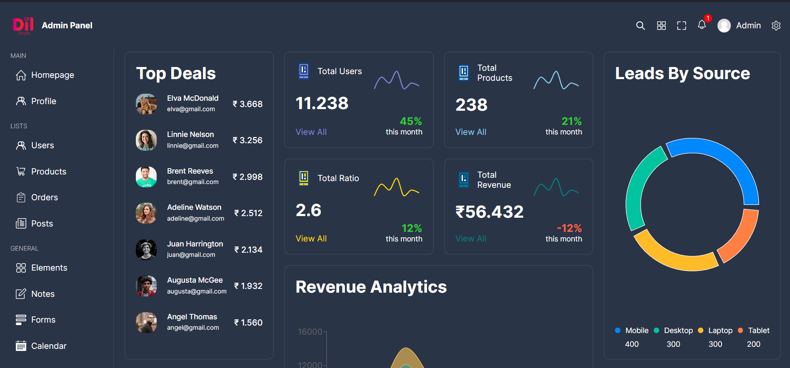
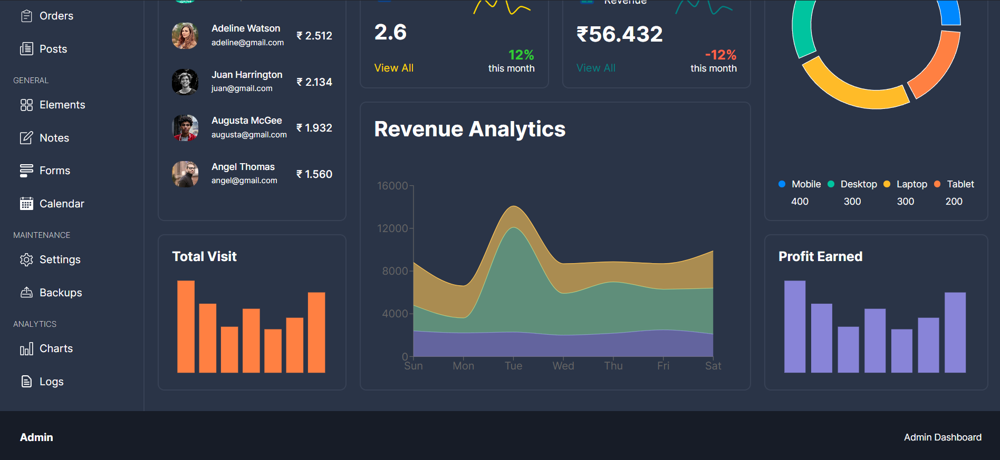
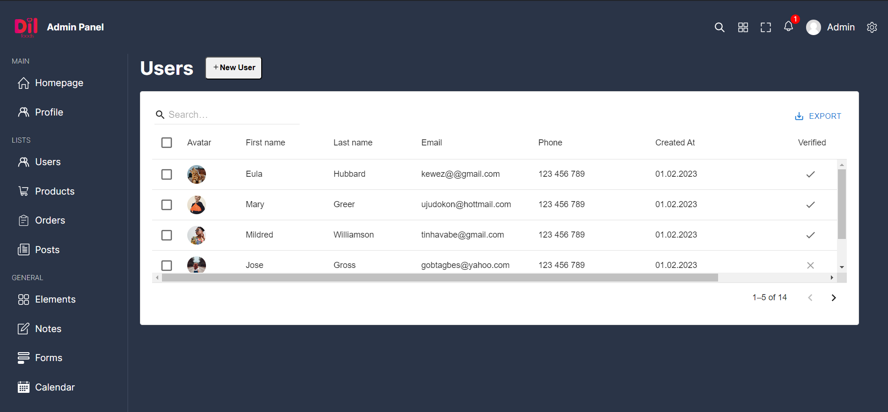
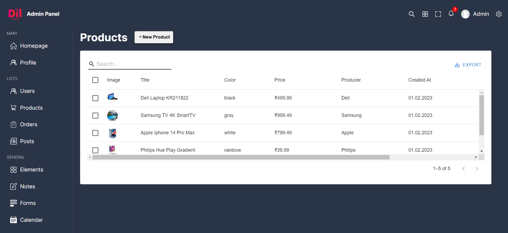
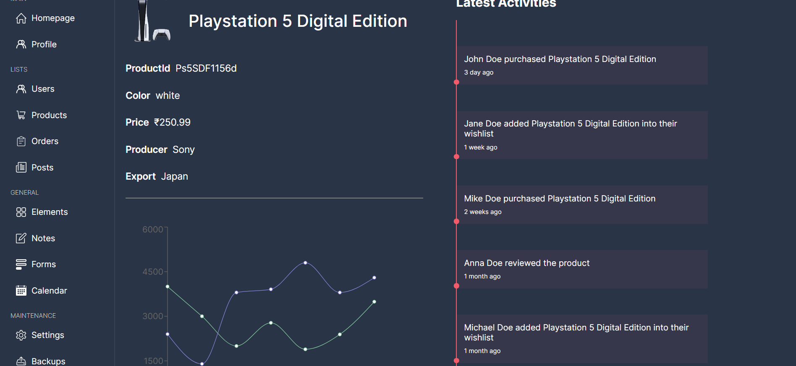
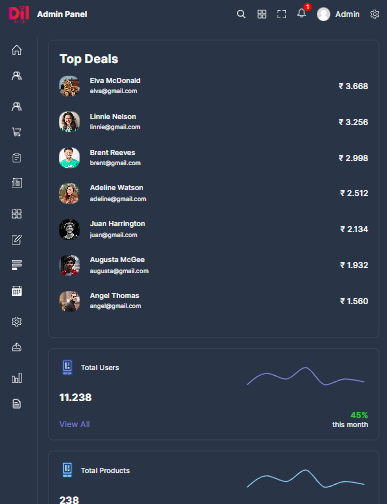
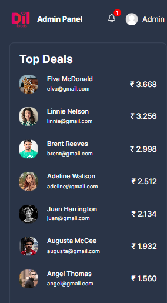

# Admin Dashboard

Welcome to the Admin Dashboard project! This dashboard provides various graphs and charts to depict important metrics such as user activity, product sales, and more. It is built using React, Recharts for data visualization, Sass for styling, and Material-UI for grid tables.

## Deployed Link
    https://dilfoods.netlify.app

## Screenshots








## Features

- Display user activity metrics using line charts.
- Visualize product sales data with bar charts.
- Utilize pie charts for showing distribution of data.
- Material-UI integration for grid tables to display detailed information.
- Responsive design for seamless experience across devices.

## Installation

To run this project locally, follow these steps:

1. Clone the repository:

    ```bash
    git clone https://github.com/khuranajordan/DilFoods-Assignment.git
    ```
2. Navigate to the project directory:
    ```
    cd DilFoods-Assignment
    ```

3. Install dependencies:
    ```
    npm install
    ```

4. Start the development server:
    ```
    npm run dev
    ```
## Technologies Used

- React
- Recharts
- Sass
- Material-UI

## Folder Structure
### Pages
```
├── [home/]
  ├── [home.scss]
  ├── [Home.tsx]
├── [product/]
  ├── [product.scss]
  ├── [Product.tsx]
├── [products/]
  ├── [products.scss]
  ├── [Products.tsx]
├── [user/]
  ├── [user.scss]
  ├── [User.tsx]
├── [users/]
  ├── [users.scss]
  ├── [Users.tsx]
```

### /src
```
├── [components/]
  ├── [add/]
    ├── [add.scss]
    ├── [Add.tsx]
  ├── [barchartbox/]
    ├── [barchartbox.scss]
    ├── [BarChartBox.tsx]
  ├── [bigchartbox/]
    ├── [bigchartbox.scss]
    ├── [BigChartBox.tsx]
  ├── [chartbox/]
    ├── [chartbox.scss]
    ├── [ChartBox.tsx]
  ├── [datatable/]
    ├── [datatable.scss]
    ├── [DataTable.tsx]
  ├── [footer/]
    ├── [footer.scss]
    ├── [Footer.tsx]
  ├── [menu/]
    ├── [menu.scss]
    ├── [Menu.tsx]
  ├── [navbar/]
    ├── [navbar.scss]
    ├── [Navbar.tsx]
  ├── [piechartbox/]
    ├── [piechartbox.scss]
    ├── [PieChartBox.tsx]
  ├── [single/]
    ├── [single.scss]
    ├── [Single.tsx]
  ├── [topbox/]
    ├── [topbox.scss]
    ├── [TopBox.tsx]
├── [styles/]
  ├── [global.scss]
  ├── [responsive.scss]
  ├── [variables.scss]
├── [App.tsx]
├── [data.ts]
├── [main.tsx]
```